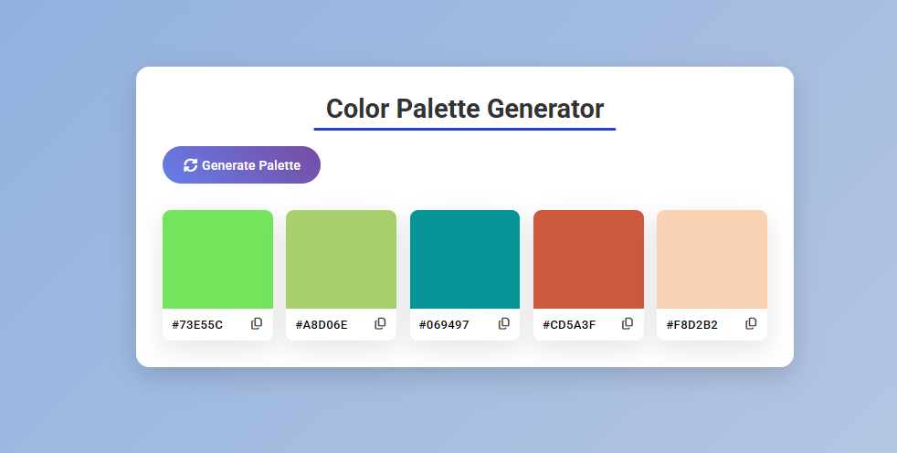

# 🎨 Color Palette Generator

A simple and interactive **Color Palette Generator** built with **HTML, CSS, and JavaScript**.  
It allows users to generate random color palettes and easily **copy hex color codes** by clicking the color or the copy icon.

---

## 🚀 Features

- 🔄 Generate a palette of 5 random colors  
- 📋 Click on a color or copy icon to copy its HEX code  
- ✅ Visual feedback when a color is successfully copied  
- 💻 Responsive and lightweight design  
- 🧠 Built with pure JavaScript (no frameworks)

---

## 🧩 Tech Stack

- **HTML5** – Structure of the app  
- **CSS3** – Styling and layout  
- **JavaScript (ES6)** – Logic for color generation, event handling, and clipboard actions  
- **Font Awesome** – Copy/check icons  

---

## 🖼️ Demo Preview

---

## ⚙️ How It Works

1. Click the **Generate Colors** button  
2. The app creates 5 random HEX colors  
3. Click any color or the copy icon to copy the HEX value  
4. A green checkmark appears briefly as visual feedback  

---

## 📂 Project Structure

